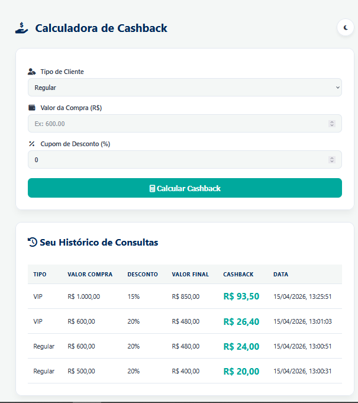
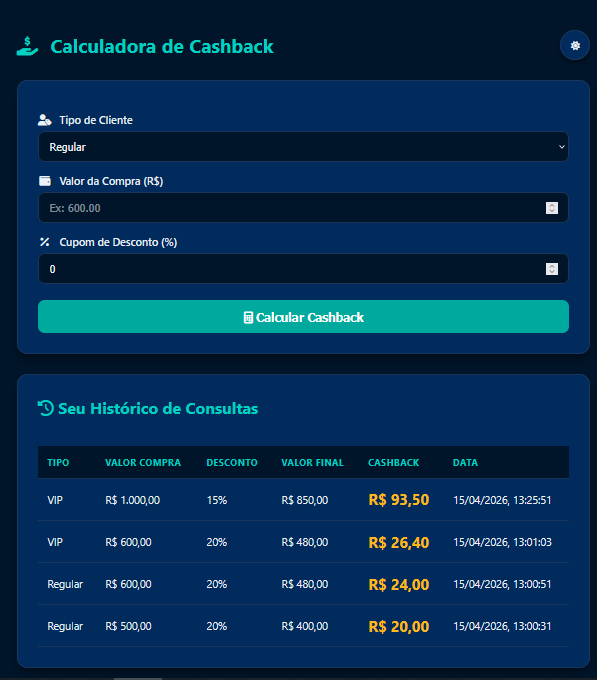
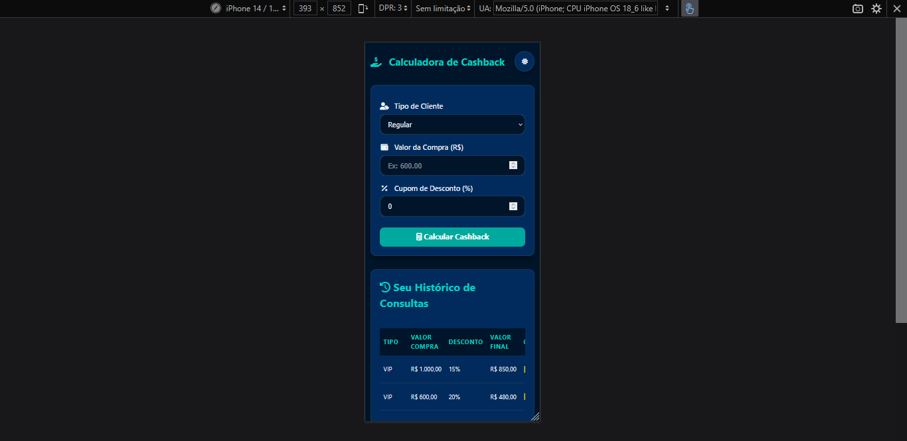
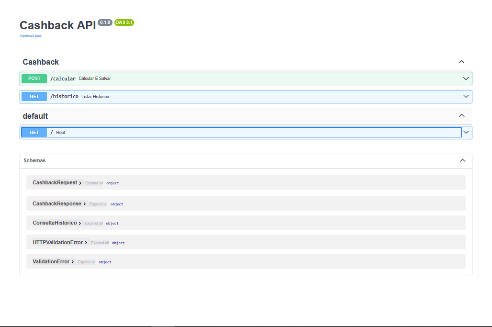

# Calculadora de Cashback: Fintech (Desafio Técnico)

Este projeto calcula o cashback de compras baseado em regras de negócio específicas da fintech, armazenando o histórico de consultas por IP do usuário em um banco de dados relacional.

## O que este projeto resolve?

O objetivo foi criar uma aplicação robusta capaz de:

- Calcular cashback dinâmico (Base 5%, Bônus VIP 10% e Dobro para compras > R$ 500).
- Persistir dados de consultas (IP, Tipo Cliente, Valores) em PostgreSQL.
- Exibir histórico de consultas filtrado automaticamente pelo IP do visitante.
- Oferecer uma interface moderna com suporte a Modo Dark e ícones profissionais.

## Tech Stack

- **Python 3.10+** — linguagem base da API.
- **FastAPI** — framework de alta performance para construção dos endpoints.
- **SQLAlchemy** — ORM para mapeamento e manipulação do banco de dados PostgreSQL.
- **Docker / Docker Compose** — orquestração de containers para Banco, API e Frontend.
- **Requirements.txt** — gerencia as dependências do Python. Mesmo no Docker, ele é crucial, pois o `Dockerfile` o utiliza para instalar as bibliotecas necessárias dentro do container de forma isolada e segura.
- **Vanilla JS / CSS3** — frontend estático e responsivo com sistema de temas (Light/Dark).
- **Railway** — plataforma de hospedagem para a API, Frontend e Banco de Dados.
- **FontAwesome** — biblioteca de ícones vetoriais.

## Estrutura do Projeto

 ```bash
 desafio-nology/
├── backend/
│   ├── app/
│   │   ├── api/v1/         # Endpoints da aplicação
│   │   ├── core/           # Configurações e conexão com DB
│   │   ├── models/         # Definição das tabelas SQL
│   │   ├── schemas/        # Validação de dados (Pydantic)
│   │   ├── services/       # Regras de negócio e lógica de cálculo
│   │   └── main.py         # Entrypoint da API
│   ├── Dockerfile          # Build da imagem Python
│   └── requirements.txt    # Dependências Python
├── frontend/
│   ├── public/             # Assets estáticos (HTML, CSS, JS)
│   └── Dockerfile          # Servidor Nginx para o frontend
└── docker-compose.yml      # Gerenciador de serviços
 ```
 
## Links de Acesso

- **Aplicação (Live):** https://ample-commitment-production-8514.up.railway.app 
- **Documentação API (Swagger):** https://calculadora-de-cashback-fintech-production-5de4.up.railway.app/docs

## Como Executar Localmente

1. Certifique-se de que o Docker Desktop está rodando.
2. Clone o repositório ou extraia os arquivos.
3. Na raiz do projeto, execute:
   ```bash
   docker-compose up --build
   ```
4. Acesse a aplicação:
   - **Interface:** [http://localhost:8080](http://localhost:8080)
   - **Documentação API (Swagger):** [http://localhost:8000/docs](http://localhost:8000/docs)

## Destaques Técnicos

- **Arquitetura Modular:** Separação clara entre lógica de negócio (services) e interface de dados (api), facilitando a manutenção.
- **Segurança (SQL Injection):** Uso de consultas parametrizadas via ORM para garantir a integridade do banco de dados.
- **User Experience (UX):** Implementação de Modo Dark persistente via LocalStorage e transições suaves de CSS.
- **Test-Driven:** Cobertura de testes unitários para validar as 3 camadas de regras de cashback exigidas.

## Fontes de Dados e Regras

- **Product Owner:** 5% base + 10% adicional para VIP.
- **Diretoria:** Dobro de cashback para compras acima de R$ 500,00.
- **Alinhamento:** Cálculo sequencial (Base -> VIP -> Promoção).

## Evidências Visuais e Testes

### Screenshots do App
Confira as capturas de tela da aplicação na pasta [evidencias/](./evidencias):
 #### Interface Principal - Modo Claro


#### Interface Principal - Modo Dark


#### Visualização Responsiva (Mobile)


#### Documentação Swagger (Backend)


### Resultados dos Testes
Os testes automatizados cobrem os cenários principais do desafio:
- **Cálculo de Cashback Base (5%)**: Validado.
- **Bônus VIP (10% sobre base)**: Validado.
- **Promoção Dobro (Compras > R$ 500)**: Validado.
- **Integração com API**: Endpoints de cálculo e histórico testados.

Para rodar os testes localmente:
```bash
cd backend
pytest
```

---
Desenvolvido por **Gabriela**
